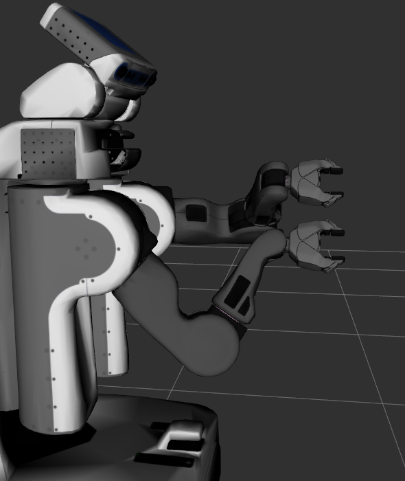

# bio-ik

## Installation and Setup

You will need ROS version Indigo or newer (wiki.ros.org).
The software was developed on Ubuntu Linux 16.04 LTS with ROS Kinetic,
but has also been tested on Ubuntu Linux 14.04 LTS with ROS Indigo.
Newer versions of ROS should work, but may need some adaptation.
See below for version specific instructions.

* Download the `bio_ik` package and unpack into your catkin workspace.
* Run `catkin_make` to compile your workspace:
  ```
    roscd
    cd src
    git clone https://github.com/TAMS-Group/bio_ik.git
    roscd
    catkin_make
  ```

* Configure Moveit to use bio-ik as the kinematics solver (see next section).
* Use Moveit to plan and execute motions or use your own code
  together with `move_group` node to move your robot.
* As usual, the public API is specified in the public header files for the `bio_ik` package,
  located in the `include/bio_ik` subdirectory;
  the sources including a few private header files are in the `src` subdirectory.


## Basic Usage

For ease of use and compatibility with existing code,
the bio-ik algorithm is encapsulated as a Moveit kinematics plugin.
Therefore, bio-ik can be used as a direct replacement of
the default Orocos/KDL-based IK solver.
Given the name of an end-effector and a 6-DOF target pose,
bio-ik will search a valid robot joint configuration that reaches the given target.

In our tests (see below), both in terms of success rate and solution time,
bio-ik regularly outperformed the Orocos [1] solver
and is competitive with trac-ik [2].
The bio-ik algorithm can also be used for high-DOF system like robot snakes,
and it will automatically converge to the best approximate solutions
for low-DOF arms where some target poses are not reachable exactly.

While you can write the Moveit configuration files by hand,
the easiest way is to run the Moveit setup assistant for your robot,
and then to select bio-ik as the IK solver when configuring the end effectors.
Once configured, the solver can be called using the standard Moveit API
or used interactively from rviz using the MotionPlanning GUI plugin.

* Make sure that you have a URDF (or xacro) model for your robot.
* Run the moveit setup assistant to create the Moveit configuration files:

  ```
  rosrun moveit_setup_assistant moveit_setup_assistant

  ```
*  The setup assistant automatically searches for all available IK solver plugins
  in your workspace.
  Therefore, you can just select select bio-ik as the IK solver
  from the drop-down list for every end effector and then configure
  the kinematics parameters, namely the default position accuracy (meters)
  and the timeout (in seconds). For typical 6-DOF or 7-DOF arms,
  an accuracy of 0.001 m (or smaller) and a timeout of 1 msec should be ok.
  More complex robots might need a longer timeout.
* Generate the moveit configuration files from the setup assistant.
  Of course, you can also edit the `config/kinematics.yaml` configuration
  file with your favorite text editor.
  For example, a configuration for the PR2 robot might look like this:

  ```
    # example kinematics.yaml for the PR2 robot
    right_arm:
      # kinematics_solver: kdl_kinematics_plugin/KDLKinematicsPlugin
      # kinematics_solver_attempts: 1
      kinematics_solver: bio_ik/BioIKKinematicsPlugin
      kinematics_solver_search_resolution: 0.005
      kinematics_solver_timeout: 0.005
      kinematics_solver_attempts: 1
    left_arm:
      kinematics_solver: bio_ik/BioIKKinematicsPlugin
      kinematics_solver_search_resolution: 0.005
      kinematics_solver_timeout: 0.005
      kinematics_solver_attempts: 1
    all:
      kinematics_solver: bio_ik/BioIKKinematicsPlugin
      kinematics_solver_search_resolution: 0.005
      kinematics_solver_timeout: 0.02
      kinematics_solver_attempts: 1

    # optional bio-ik configuration parameters
    #  center_joints_weight: 1
    #  minimal_displacement_weight: 1
    #  avoid_joint_limits_weight: 1
  ```


* For a first test, run the Moveit-created demo launch. Once rviz is running,
  enable the motion planning plugin, then select one of the end effectors
  of you robot. Rviz should show an 6-D (position and orientation)
  interactive marker for the selected end-effector(s).
  Move the interactive marker and watch bio-ik calculating poses for your robot.

  If you also installed the bio-ik demo (see below), you should be able
  to run one of the predefined demos:
  ```
    roslaunch pr2_bioik_moveit demo.launch
    roslaunch pr2_bioik_moveit valve.launch
    roslaunch pr2_bioik_moveit dance.launch
  ```

* You are now ready to use bio-ik from your C/C++ and Python programs,
  using the standard Moveit API.
  To explicitly request an IK solution in C++:
  ```
    robot_model_loader::RobotModelLoader robot_model_loader(robot);

    auto robot_model = robot_model_loader.getModel();
    auto joint_model_group = robot_model->getJointModelGroup(group);
    auto tip_names = joint_model_group->getSolverInstance()->getTipFrames();

    kinematics::KinematicsQueryOptions opts;
    opts.return_approximate_solution = true; // optional

    robot_state::RobotState robot_state_ik(robot_model);

    // traditional "basic" bio-ik usage. The end-effector goal poses
    // and end-effector link names are passed into the setFromIK()
    // call. The KinematicsQueryOptions are empty.
    //
    bool ok = robot_state_ik.setFromIK(
                joint_model_group, // joints to be used for IK
                tip_transforms,    // multiple end-effector goal poses
                tip_names,         // names of the end-effector links
                attempts, timeout, // solver attempts and timeout
                moveit::core::GroupStateValidityCallbackFn(),
                opts               // mostly empty
              );
  ```

## Advanced Usage

For many robot applications, it is essential to specify more than just
a single end-effector pose. Typical examples include

* redundancy resolution (e.g. 7-DOF arm)
* two-arm manipulation tasks on two-arm robots (e.g. Baxter)
* multi end-effector tasks with shared kinematic links
* grasping and manipulation tasks with multi-finger hands
* full-body motion on humanoid robots
* reaching tasks with additional constraints (e.g. shoulder position)
* incremental tool motions without robot arm configuration changes
* and many more

In bio-ik, such tasks are specified as a combination of multiple
individual *goals*.  
The algorithm then tries to find a robot configuration
that fulfills all given goals simultaneously by minimizing
a quadratic error function built from the weighted individual goals.
While the current Moveit API does not support multiple-goals tasks directly,
it provides the KinematicQueryOptions class.
Therefore, bio-ik simply provides a set of predefined motion goals,
and a combination of the user-specified goals is passed via Moveit to the IK solver.
No API changes are required in Moveit, but using the IK solver now consists
passing the weighted goals via the KinematicQueryOptions.
The predefined goals include:

* *PoseGoal*: a full 6-DOF robot pose
* *PositionGoal*: a 3-DOF (x,y,z) position
* *OrientationGoal*: a 3-DOF orientation, encoded as a quaternion (qx,qy,qz,qw)
* *LookAtGoal*: a 3-DOF (x,y,z) position intended as a looking direction
   for a camera or robot head
* *JointGoal*: a set of joint angles, e.g. to specify a
* *FunctionGoal*: an arbitrary function of the robot joint values,
   e.g. to model underactuated joints or mimic joints
* and several more


To solve a motion problem on your robot, the trick now is to construct
a suitable combination of individual goals.



In the following example, we want to grasp and then _slowly turn
a valve wheel_ with the left and right gripers of the PR2 robot:

  ```
    bio_ik::BioIKKinematicsQueryOptions ik_options;
    ik_options.replace = true;
    ik_options.return_approximate_solution = true;

    auto* ll_goal = new bio_ik::PoseGoal();
    auto* lr_goal = new bio_ik::PoseGoal();
    auto* rl_goal = new bio_ik::PoseGoal();
    auto* rr_goal = new bio_ik::PoseGoal();
    ll_goal->setLinkName("l_gripper_l_finger_tip_link");
    lr_goal->setLinkName("l_gripper_r_finger_tip_link");
    rl_goal->setLinkName("r_gripper_l_finger_tip_link");
    rr_goal->setLinkName("r_gripper_r_finger_tip_link");
    ik_options.goals.emplace_back(ll_goal);
    ik_options.goals.emplace_back(lr_goal);
    ik_options.goals.emplace_back(rl_goal);
    ik_options.goals.emplace_back(rr_goal);
  ```

We also set a couple of secondary goals.
First, we want that the head of the PR2 looks at the center of the valve.
Second, we want to avoid joint-limits on all joints, if possible.
Third, we want that IK solutions are as close as possible to the previous
joint configuration, meaning small and efficient motions. This is handled
by adding the MinimalDisplacementGoal.
Fourth, we want to avoid torso lift motions, which are very slow on the PR2.
All of this is specified easily:

 ```
    auto* lookat_goal = new bio_ik::LookAtGoal();
    lookat_goal->setLinkName("sensor_mount_link");
    ik_options.goals.emplace_back(lookat_goal);

    auto* avoid_joint_limits_goal = new bio_ik::AvoidJointLimitsGoal();
    ik_options.goals.emplace_back(avoid_joint_limits_goal);

    auto* minimal_displacement_goal = new bio_ik::MinimalDisplacementGoal();
    ik_options.goals.emplace_back(minimal_displacement_goal);

    auto* torso_goal = new bio_ik::PositionGoal();
    torso_goal->setLinkName("torso_lift_link");
    torso_goal->setWeight(1);
    torso_goal->setPosition(tf::Vector3( -0.05, 0, 1.0 ));
    ik_options.goals.emplace_back(torso_goal);
  ```

For the actual turning motion, we calculate a set of required gripper
poses in a loop:
  ```
    for(int i = 0; ; i++) {
        tf::Vector3 center(0.7, 0, 1);

        double t = i * 0.1;
        double r = 0.1;
        double a = sin(t) * 1;
        double dx = fmin(0.0, cos(t) * -0.1);
        double dy = cos(a) * r;
        double dz = sin(a) * r;

        tf::Vector3 dl(dx, +dy, +dz);
        tf::Vector3 dr(dx, -dy, -dz);
        tf::Vector3 dg = tf::Vector3(0, cos(a), sin(a)) * (0.025 + fmin(0.025, fmax(0.0, cos(t) * 0.1)));

        ll_goal->setPosition(center + dl + dg);
        lr_goal->setPosition(center + dl - dg);
        rl_goal->setPosition(center + dr + dg);
        rr_goal->setPosition(center + dr - dg);

        double ro = 0;
        ll_goal->setOrientation(tf::Quaternion(tf::Vector3(1, 0, 0), a + ro));
        lr_goal->setOrientation(tf::Quaternion(tf::Vector3(1, 0, 0), a + ro));
        rl_goal->setOrientation(tf::Quaternion(tf::Vector3(1, 0, 0), a + ro));
        rr_goal->setOrientation(tf::Quaternion(tf::Vector3(1, 0, 0), a + ro));

        lookat_goal->setAxis(tf::Vector3(1, 0, 0));
        lookat_goal->setTarget(rr_goal->getPosition());

        // "advanced" bio-ik usage. The call parameters for the end-effector
        // poses and end-effector link names are left empty; instead the
        // requested goals and weights are passed via the ik_options object.
        //
        robot_state.setFromIK(
                      joint_model_group,           // active PR2 joints
                      EigenSTL::vector_Affine3d(), // no explicit poses here
                      std::vector<std::string>(),  // no end effector links here
                      0, 0.0,                      // take values from YAML file
                      moveit::core::GroupStateValidityCallbackFn(),
                      ik_options       // four gripper goals and secondary goals
                    );

        ... // check solution validity and actually move the robot
    }
  ```

When you execute the code, the PR2 will reach for the valve wheel
and turn it. Every once in a while it can't reach the valve with
its current arm configuration and will regrasp the wheel.

See [3] and [4] for more examples. 


## Local vs. Global Optimization, Redundancy Resolution, Cartesian Jogging
BioIK has been developed to efficiently find good solutions for non-convex inverse kinematics problems with multiple goals and local minima.
However, for some applications, this can lead to unintuitive results.
If there are multiple possible solutions to a given IK problem, and if the user has not explicitly specified which one to choose, a result may be selected randomly from the set of all valid solutions.
When incrementally tracking a cartesian path, this can result in unwanted jumps, shaking, etc.
To incrementally generate a smooth trajectory using BioIK, the desired behaviour should be specified explicitly, which can be done in two ways.

#### Disabling Global Optimization
BioIK offers a number of different solvers, including global optimizers and local optimizers.
By default, BioIK uses a memetic global optimizer (`bio2_memetic`).
A different solver class can be selected by setting the `mode` parameter in the `kinematics.yaml` file of your MoveIt robot configuration.

Example:
```
all:
  kinematics_solver: bio_ik/BioIKKinematicsPlugin
  kinematics_solver_search_resolution: 0.005
  kinematics_solver_timeout: 0.02
  kinematics_solver_attempts: 1
  mode: gd_c
```

Currently available local optimizers:
```
gd, gd_2, gd_4, gd_8
gd_r, gd_r_2, gd_r_4, gd_r_8
gd_c, gd_c_2, gd_c_4, gd_c_8
jac, jac_2, jac_4, jac_8
```

Naming convention: `<solver type>_[<variant>_]<number of threads>`

Notes:
- The `gd_*` solvers support arbitrary goal types.
- The `jac_*` solvers only support pose goals but might in theory be more stable in some cases.
- Relative performance depends on the application (it's probably best if you try it yourself for your particular robot and problem types).
- During our tests, the `gd_c` variants usually outperformed the other local solvers.
- For incremental tracking, a single-threaded variant without restarts is probably best suited (`gd_c`, `gd`, or `jac`).
- You can also create different MoveIt move groups with different solver types. If you now want to plan a cartesian trajectory from end effector pose A to end effector pose B, you can use a move group with a global optimizer to find a matching initial pose for end effector pose A and a different move group with a local optimizer for incrementally generating a smooth cartesian trajectory from A to B.

#### Regularization

You can force a global optimizer to return a local minimum through regularization. 

* For the specific case of incremental robot motions (aka *jogging*),
  the simplest solution is to specify both a *PoseGoal* and the
  special *RegularizationGoal*, which tries to keep the joint-space
  IK solution as close as possible to the given robot seed configuration.
  Typically you would use a high weight for the *PoseGoal* and a
  smaller weight to the regularizer.

* You can also add a *MinimalDisplacementGoal* instead of the
  *RegularizationGoal*. Both goals try to keep the IK solution close
  to the current/seed robot state, but differ slightly in the handling
  of fast and slow robot joints (e.g. the PR2 has fast arm joints
  and a rather slow torso lift joint).
  You might want to play with both goals to see which one better
  matches your needs.

* Some industrial robot controllers on 7-DOF arms behave as if working
  on a 6-DOF arm with one extra joint. Typically, the value of the extra
  joint can be specified, and an IK solution is then searched for the
  remaining six joints.
  This behaviour can be achieved in bio-ik by combining a *PoseGoal*
  for the end-effector with a *JointPositionGoal* for one (any one)
  of the robot joints.

* Another useful trick is trying to keep the robot joints centered,
  as this will allow robot (joint) motions in both directions.
  Just combine the *PoseGoal* with a *CenterJointsGoal*, and optionally
  also a *RegularizationGaol*.

* You can also combine regularization with a local `gd_*` solver.


## How it works

The bio-ik solver is based on a memetic algorithm that combines
gradient-based optimization with genetic and particle swarm optimization.

Internally, vectors of all robot joint values are used to encode
different intermediate solutions (the *genotype* of the genetic algorithm).
During the optimization, joint values are always checked against the
active lower and upper joint limits, so that only valid robot configurations
are generated.

To calculate the fitness of individuals, the cumulative error over all
given individual goals is calculated.
Any individual with zero error is an exact solution for the IK problem,
while individuals with small error correspond to approximate solutions.

Individuals are sorted by their fitness, and gradient-based optimization
is tried on the best few configuration, resulting in fast convergence
and good performance for many problems.
If no solution is found from the gradient-based optimization,
new individuals are created by a set of mutation and recombination operators,
resulting in good search-space exploration.

See [3] and [4] for more details. See [5] and [6] for an in-depth explanation of an 
earlier evolutionary algorithm for animating video game characters.

## Running the Self-Tests

We have tested bio-ik on many different robot arms,
both using the tranditional single end-effector API
and the advanced multi end-effector API based on the KinematicsQueryOptions.

One simple selftest consists of generating random valid robot configurations,
running forward kinematics to calculate the resulting end-effector pose,
and the querying the IK plugin to find a suitable robot joint configuration.
Success is then checked by running forrward kinematics again and checking
that the end-effector pose for the generated IK solution matches the target pose.
This approach can be run easily for thousands or millions of random poses,
samples the full workspace of the robot,
and allows to quickly generate success-rate and solution-time estimates
for the selected IK solver.

Of course, running the tests requires installing the corresponding robot
models and adds a lot of dependencies.
Therefore, those tests are not included in the standard bio-ik package,
but are packaged separately.

For convenience, we provide the `pr2_bioik_moveit` package,
which also includes a few bio-ik demos for the PR2 service robot.
These are kinematics only demos; but of course you can also try
running the demos on the real robot (if you have one) or the Gazebo
simulator (if you installed Gazebo).

Simply clone the PR2 description package (inside `pr2_common`)
and the `pr2_bioik_moveit` package into your catkin workspace:
  ```
    roscd
    cd src
    git clone https://github.com/PR2/pr2_common.git
    git clone https://github.com/TAMS-Group/bioik_pr2.git
    catkin_make
  ```

For the FK-IK-FK performance test, please run

  ```
  roslaunch pr2_bioik_moveit env_pr2.launch
  roslaunch pr2_bioik_moveit test_fk_ik.launch
  ... // wait for test completion and results summary
  ```


## References

 1. Orocos Kinematics and Dynamics, http://www.orocos.org

 2. P. Beeson and B. Ames, *TRAC-IK:
    An open-source library for improved solving of generic inverse kinematics*,
    Proceedings of the IEEE RAS Humanoids Conference, Seoul, Korea, November 2015.

 3. Philipp Ruppel, Norman Hendrich, Sebastian Starke, Jianwei Zhang, *Cost Functions to Specify Full-Body Motion and Multi-Goal Manipulation Tasks*, IEEE International Conference on Robotics and Automation, (ICRA-2018), Brisbane, Australia. DOI: [10.1109/ICRA.2018.8460799](http://doi.org/10.1109/ICRA.2018.8460799)

 4. Philipp Ruppel, *Performance optimization and implementation
    of evolutionary inverse kinematics in ROS*,
    MSc thesis, University of Hamburg, 2017
    [PDF](https://tams.informatik.uni-hamburg.de/publications/2017/MSc_Philipp_Ruppel.pdf)

 5. Sebastian Starke, Norman Hendrich, Jianwei Zhang,  *A Memetic
    Evolutionary Algorithm for Real-Time Articulated Kinematic Motion*,
    IEEE Intl. Congress on Evolutionary Computation (CEC-2017), p.2437-2479, June 4-8, 2017,
    San Sebastian, Spain.
    DOI: [10.1109/CEC.2017.7969605](http://doi.org/10.1109/CEC.2017.7969605)

 6. Sebastian Starke, Norman Hendrich, Dennis Krupke, Jianwei Zhang, *Multi-Objective
    Evolutionary Optimisation for Inverse Kinematics
    on Highly Articulated and Humanoid Robots*,
    IEEE Intl. Conference on Intelligent Robots and Systems (IROS-2017),
    September 24-28, 2017, Vancouver, Canada
   

